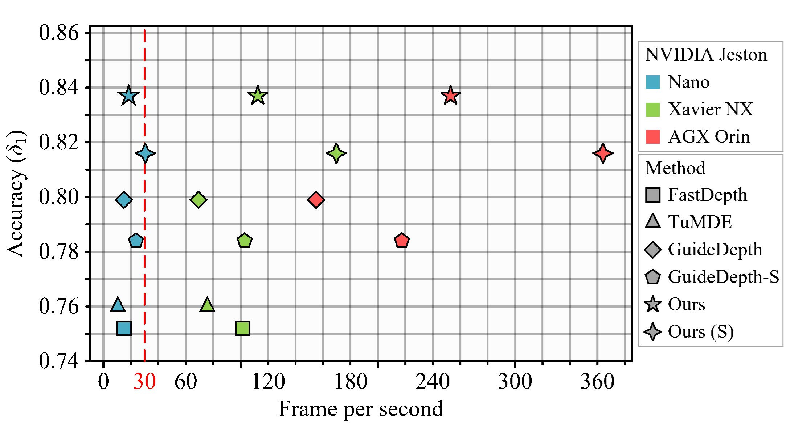

# RT-Monodepth

This is the reference PyTorch implementation for training and testing depth estimation models using the method described in

> **Real-time Monocular Depth Estimation on Embedded Systems**
>
> [ICIP 2024 (arXiv pdf)](https://arxiv.org/abs/2308.10569)

<div align=center>

</div>


This code is for non-commercial use;

If you find our work useful in your research please consider citing our paper:

```
@article{rtmonodepth,
  author       = {Cheng Feng and
                  Zhen Chen and
                  Congxuan Zhang and
                  Weiming Hu and
                  Bing Li and
                  Liyue Ge},
  title        = {Real-time Monocular Depth Estimation on Embedded Systems},
  booktitle    = {{IEEE} International Conference on Image Processing, {ICIP} 2024,
                  Abu Dhabi, United Arab Emirates, October 27-30, 2024},
  publisher    = {{IEEE}},
  year         = {2024},
}
```


## ⚙️ Setup
The pretrained models can be downloaded from [google drive](https://drive.google.com/file/d/1Jf5K3m0DfAqVcVCE6y0cKufEKIHu86sz/view?usp=drive_link).

The code have been tested under following dependencies:
```
numpy=1.24.3
opencv-python=4.10.0
pillow=10.3.0
scikit-image=0.24.0
pytorch=2.3.1
torchvision=0.18.1
```
Following [Monodepth2](https://github.com/nianticlabs/monodepth2), we also recommend using `pillow-simd` instead of `pillow` for faster image preprocessing in the dataloaders.


## 🖼️ Prediction for eigen test split
Firstly, set the dataset root ([line 10, test_simple.py](https://github.com/Ecalpal/RT-MonoDepth/blob/2cb4040162798c27a4c2ca4302caeb6b4d8a67c3/pick_test_images.py#L10)) and execute `python pick_test_images.py`.

Then, you can predict scaled disparity for eigen test split with:

```shell
python test_simple_full.py --image_path ./fortest/data --weight_path ./weights/RTMonoDepth/full/m_640_192/
python test_simple_s.py --image_path ./fortest/data --weight_path ./weights/RTMonoDepth/s/m_640_192/
```

or, if you are using a stereo-trained model, you can estimate metric depth with

```shell
python test_simple_full.py --image_path ./fortest/data --weight_path ./weights/RTMonoDepth/full/ms_640_192/ --pred_metric_depth
python test_simple_s.py --image_path ./fortest/data --weight_path ./weights/RTMonoDepth/s/ms_640_192/ --pred_metric_depth
```

## 📊 Test the runtime on the Desktop GPU
We provide an example of comparing our small model with Fastdepth, where you can change the RTMonoDepth_s to RTMonoDesth in [here](https://github.com/Ecalpal/RT-MonoDepth/blob/b32d6e6469422dd10f8a3214874b91023a05b7cc/compare_runtime.py#L9) to test our full model.
```shell
python compare_runtime.py
```


## 📊 Test the runtime on Embedded Systems
We performed our evaluation on the NVIDIA Jetson Nano and the NVIDIA Xavier NX and NVIDIA AGX Orin, using the following dependencies:

Installing PyTorch and torchvision, refer to this post: https://forums.developer.nvidia.com/t/pytorch-for-jetson-version-1-11-now-available/72048

Installing torch2trt: https://github.com/NVIDIA-AI-IOT/torch2trt

You might need to increase SWAP memory for the tensorRT conversion to 4GB: https://github.com/JetsonHacksNano/resizeSwapMemory

```shell
python embedded_platform_runtime_test.py
```
You can also change the RTMonoDepth to RTMonoDesth_s in [here](https://github.com/Ecalpal/RT-MonoDepth/blob/b32d6e6469422dd10f8a3214874b91023a05b7cc/embedded_platform_runtime_test.py#L8) to test our small model.


## 💾 KITTI training data

You can download the entire [raw KITTI dataset](http://www.cvlibs.net/datasets/kitti/raw_data.php) by running:
```shell
wget -i splits/kitti_archives_to_download.txt -P kitti_data/
```
Then unzip with
```shell
cd kitti_data
unzip "*.zip"
cd ..
```
**Warning:** it weighs about **175GB**, so make sure you have enough space to unzip too!

Our default settings expect that you have converted the png images to jpeg with this command, **which also deletes the raw KITTI `.png` files**:
```shell
find kitti_data/ -name '*.png' | parallel 'convert -quality 92 -sampling-factor 2x2,1x1,1x1 {.}.png {.}.jpg && rm {}'
```
**or** you can skip this conversion step and train from raw png files by adding the flag `--png` when training, at the expense of slower load times.

The above conversion command creates images which match our experiments, where KITTI `.png` images were converted to `.jpg` on Ubuntu 16.04 with default chroma subsampling `2x2,1x1,1x1`.
We found that Ubuntu 18.04 defaults to `2x2,2x2,2x2`, which gives different results, hence the explicit parameter in the conversion command.

You can also place the KITTI dataset wherever you like and point towards it with the `--data_path` flag during training and evaluation.

**Splits**

The train/test/validation splits are defined in the `splits/` folder.
By default, the code will train a depth model using [Zhou's subset](https://github.com/tinghuiz/SfMLearner) of the standard Eigen split of KITTI, which is designed for monocular training.
You can also train a model using the new [benchmark split](http://www.cvlibs.net/datasets/kitti/eval_depth.php?benchmark=depth_prediction) or the [odometry split](http://www.cvlibs.net/datasets/kitti/eval_odometry.php) by setting the `--split` flag.


## ⏳ Training

**Monocular training:**
```shell
python train.py --model_name mono_model
```

**Stereo training:**

Our code defaults to using Zhou's subsampled Eigen training data. For stereo-only training we have to specify that we want to use the full Eigen training set – see paper for details.
```shell
python train.py --model_name RTMonoDepth_s --data_path Your_path_to_kitti_raw --num_workers=8 --batch_size=16 --scales 0 1 2 3 --num_epochs 31
```

**Monocular + stereo training:**
```shell
python train.py --model_name RTMonoDepth_ms --data_path Your_path_to_kitti_raw --num_workers=8 --batch_size=16 --scales 0 1 2 3 --num_epochs 31 --use_stereo
```


### GPUs

The code can only be run on a single GPU.
You can specify which GPU to use with the `CUDA_VISIBLE_DEVICES` environment variable:
```shell
CUDA_VISIBLE_DEVICES=2 python train.py --model_name mono_model
```


### 💽 Finetuning a pretrained model

Add the following to the training command to load an existing model for finetuning:
```shell
python train.py --model_name finetuned_mono --load_weights_folder ./log/mono_model/models/weights_19
```


### 🔧 Other training options

Run `python train.py -h` (or look at `options.py`) to see the range of other training options, such as learning rates and ablation settings.


## 📊 KITTI evaluation

To prepare the ground truth depth maps run:
```shell
python export_gt_depth.py --data_path Your_path_to_kitti_raw --split eigen
python export_gt_depth.py --data_path Your_path_to_kitti_raw --split eigen_benchmark
```
...assuming that you have placed the KITTI dataset in the default location of `./kitti_data/`.

The following example command evaluates the pretrained models:
```shell
python evaluate_depth_full.py --data_path Your_path_to_kitti_raw --load_weights_folder ./weights/RTMonoDepth/s/m_640_192/ --eval_mono
python evaluate_depth_s.py --data_path Your_path_to_kitti_raw --load_weights_folder ./weights/RTMonoDepth/s/m_640_192/ --eval_mono
```
For stereo models, you must use the `--eval_stereo` flag (see note below):
```shell
python evaluate_depth_full.py --data_path Your_path_to_kitti_raw --load_weights_folder ./weights/RTMonoDepth/ms/m_640_192/ --eval_stereo
python evaluate_depth_s.py --data_path Your_path_to_kitti_raw --load_weights_folder ./weights/RTMonoDepth/s/ms_640_192/ --eval_stereo
```
If you train your own model with our code you are likely to see slight differences to the publication results due to randomization in the weights initialization and data loading.

An additional parameter `--eval_split` can be set.
The three different values possible for `eval_split` are explained here:

| `--eval_split`        | Test set size | For models trained with... | Description  |
|-----------------------|---------------|----------------------------|--------------|
| **`eigen`**           | 697           | `--split eigen_zhou` (default) or `--split eigen_full` | The standard Eigen test files |
| **`eigen_benchmark`** | 652           | `--split eigen_zhou` (default) or `--split eigen_full`  | Evaluate with the improved ground truth from the [new KITTI depth benchmark](http://www.cvlibs.net/datasets/kitti/eval_depth.php?benchmark=depth_prediction) |
| **`benchmark`**       | 500           | `--split benchmark`        | The [new KITTI depth benchmark](http://www.cvlibs.net/datasets/kitti/eval_depth.php?benchmark=depth_prediction) test files. |

Because no ground truth is available for the new KITTI depth benchmark, no scores will be reported  when `--eval_split benchmark` is set.
Instead, a set of `.png` images will be saved to disk ready for upload to the evaluation server.


**📷 Note on stereo evaluation**

Our stereo models are trained with an effective baseline of `0.1` units, while the actual KITTI stereo rig has a baseline of `0.54m`. This means a scaling of `5.4` must be applied for evaluation.
In addition, for models trained with stereo supervision we disable median scaling.
Setting the `--eval_stereo` flag when evaluating will automatically disable median scaling and scale predicted depths by `5.4`.


## 👩‍⚖️ Acknowledgement and License
The majority of the code for this project comes from [Monodepth2](https://github.com/nianticlabs/monodepth2). We appreciate the outstanding contributions Project has made to this field.

Meanwhile, the licensing of this project is the same as that of [Monodepth2](https://github.com/nianticlabs/monodepth2).
